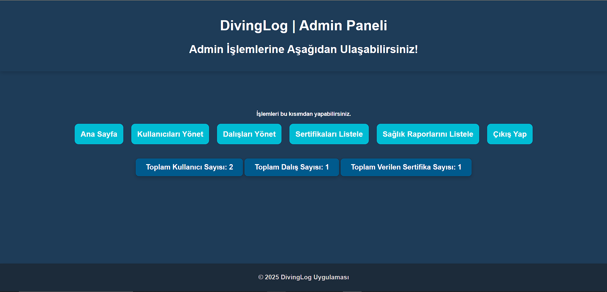
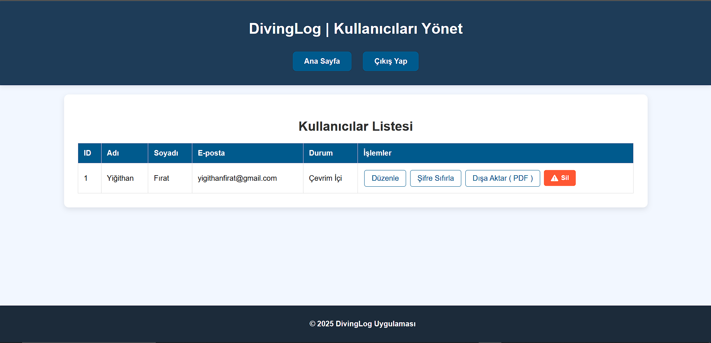

# DivingLog
Kullanıcıların dalışlarını kaydetmelerine ve takip etmelerine yardımcı olur. Uygulama, dalış deneyimlerinizi not almanıza, dalış verilerinizi depolamanıza ve analiz etmenize olanak tanır.

## User Register
Kullanıcı kaydına ait işlemler tamamlanmıştır ve fotoğraf paylaşılmıştır.

## Web Icon
Web sitesine ait ikon eklenmiştir ve fotoğraf paylaşılmıştır.

## Admin Dashboard
Admin dashboard arayüzü yapıldı, kullanıcı kontrolleri yapılabilmesi ve listelenebilmesi sağlandı.

## Reset Password
Adminler tarafından şifrelerini unutan kullanıcıların şifrelerinin sıfırlanabilmesi sağlandı.

## Managing Users
Bir kullanıcının tüm bilgilerini görüp düzenleyebilme sağlandı.

## Index Diving Plan
Anasayfa su altı dalışı planlaması yapılabilmesi için butonla yönlendirilebilir bir kısım yapıldı.

## Diving Plan Form
Dalış planına ait tüm bilgilerin girilebilir ve seçilebilir olduğu bir form tasarlandı.

