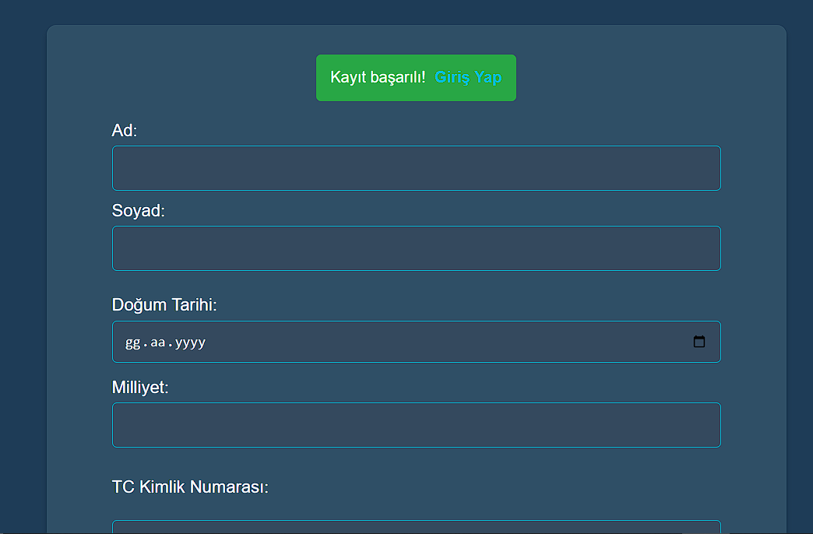
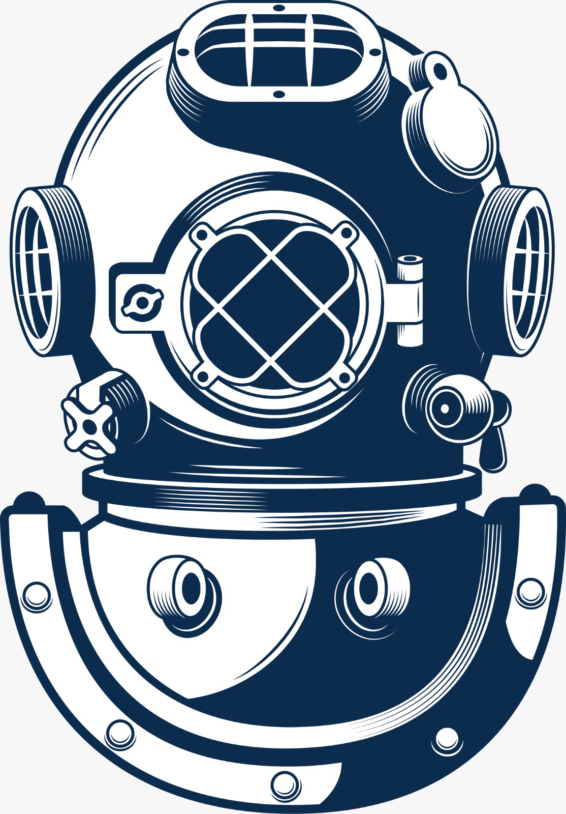

# DivingLog
Kullanıcıların dalışlarını kaydetmelerine ve takip etmelerine yardımcı olur. Uygulama, dalış deneyimlerinizi not almanıza, dalış verilerinizi depolamanıza ve analiz etmenize olanak tanır.

## Greetings
Kullanıcıların anasayfaya bağlanma durumlarına göre selamlama eklendi. Giriş yapmışsa adıyla, yapmamışsa MİSAFİR ÜYE olarak selamlama yapılmaktadır.

## User Register
Kullanıcı kaydına ait işlemler tamamlanmıştır ve fotoğraf paylaşılmıştır.

## Web Icon
Web sitesine ait ikon eklenmiştir ve fotoğraf paylaşılmıştır.

## Admin Dashboard
Admin dashboard eklendi. Dashboard üstünden kullanıcıları yönetebilme, dalışları yönetebilme, hesabınız çıkış yapma veya anasayfaya yönlendirme gibi işlemler eklendi.

## Reset Password
Adminler tarafından şifrelerini unutan kullanıcıların şifrelerinin sıfırlanabilmesi sağlandı.

## Managing Users
Kullanıcı bilgilerinin bazılarının görüntülenip düzenleyebilme, silme ve bilgileri PDF olarak dışarıya aktarma eklendi.

## Index Diving Plan
Anasayfa su altı dalışı planlaması yapılabilmesi için butonla yönlendirilebilir bir kısım yapıldı.

## Diving Plan Form
Dalış planına ait tüm bilgilerin girilebilir ve seçilebilir olduğu bir form tasarlandı.

